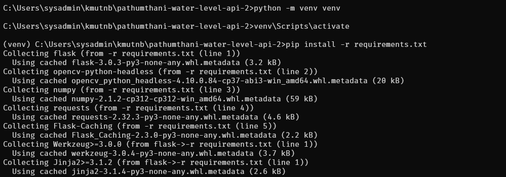
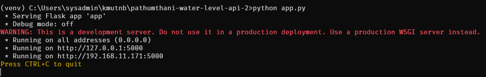
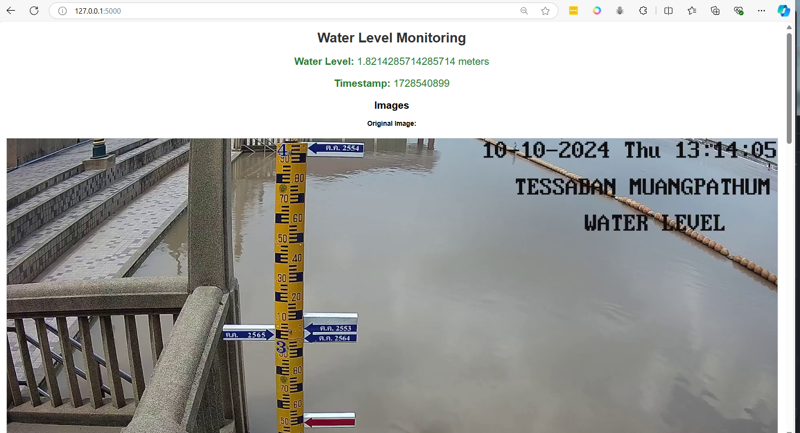
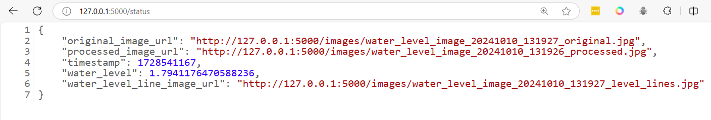

# workshop 3

- Clone project 
```
git clone https://github.com/opendevbook/pathumthani-water-level-api-2.git
```

- add python environment
```
cd pathumthani-water-level-api-2
rm .git
python -m venv venv
venv\Scripts\activate
pip install -r requirements.txt
```



- Start application
```
python app.py
```



- Open browser http://127.0.0.1



- Open browser http://127.0.0.1/status


