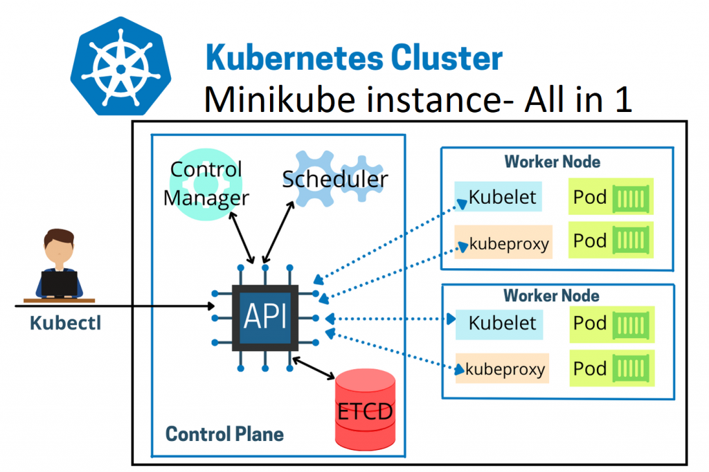

# install minikube



on window create folder for project vm
```
mkdir minikube
cd minikube
code Vagrantfile
```

```ruby
# -*- mode: ruby -*-
# vi: set ft=ruby :

Vagrant.configure("2") do |config|

  config.vm.box = "generic/centos9s"
  config.vm.network "forwarded_port", guest: 80, host: 8080
  config.vm.network "forwarded_port", guest: 15432, host: 15432
  config.vm.network "private_network", ip: "192.168.33.10"

  # config.vm.network "public_network"

  # config.vm.synced_folder "../data", "/vagrant_data"

  #config.vm.synced_folder ".", "/vagrant"


  config.vm.provider "virtualbox" do |vb|
      vb.memory = "2048"
      vb.cpus = 2
  end

  config.vm.provision "shell", inline: <<-SHELL
    #add docker repository
    sudo dnf install -y yum-utils device-mapper-persistent-data lvm2
    sudo dnf config-manager --add-repo=https://download.docker.com/linux/centos/docker-ce.repo
    sudo dnf repolist -v
    #install docker
    sudo dnf install docker-ce -y
    sudo systemctl enable --now docker
    sudo systemctl status docker
    # add vagrant user to docker group
    sudo groupadd docker
    sudo usermod -aG docker vagrant
    newgrp docker
    # Run docker ps
    echo "Run Test docker command"
    sudo docker ps
    echo "Install kubernetes repo"
    cat >> /etc/yum.repos.d/kubernetes.repo <<EOF
[kubernetes]
name=Kubernetes
baseurl=https://pkgs.k8s.io/core:/stable:/v1.29/rpm/
enabled=1
gpgcheck=1
gpgkey=https://pkgs.k8s.io/core:/stable:/v1.29/rpm/repodata/repomd.xml.key
exclude=kubelet kubeadm kubectl cri-tools kubernetes-cni
EOF

  sudo dnf install -y kubectl --nobest

  echo "kubectl version --output=yaml"
  sudo kubectl version --output=yaml

  #Download minikube
  curl -LO https://storage.googleapis.com/minikube/releases/latest/minikube-linux-amd64
  sudo chmod +x minikube-linux-amd64

  sudo mv minikube-linux-amd64 /usr/local/bin/minikube
  SHELL
end
```

- Create VM with provision
```
vagrant up
vagrant provision
vagrant ssh
```

- Start Minikube
```
$ minikube start
```

- Verify Installation
```
$ kubectl cluster-info
```

## Install minikube on CentOs9 Stream: Accessing the  Kubernetes Dashboard

```
$ minikube dashboard
```