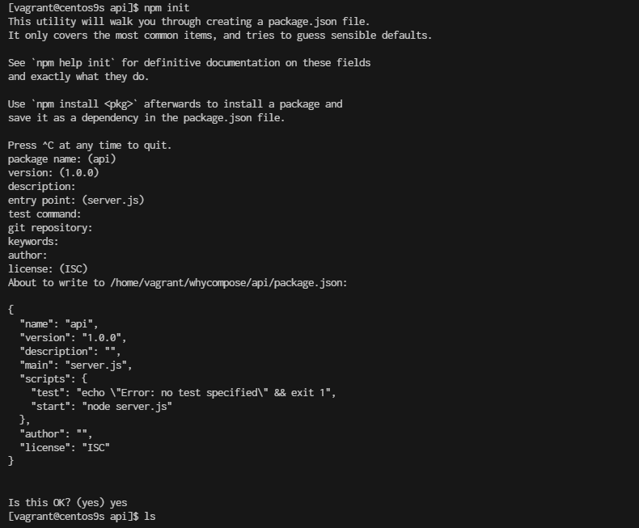

# Why Docker Compose


- Structure Folder
```
cd 
mkdir whycompose
cd whycompose
mkdir api
cd api
npm init 
```



- Create project
    - create file server.js
```
cat <<EOF | tee server.js
let express = require('express');
var cors=require("cors");
let path = require('path');
let fs = require('fs');
let MongoClient = require('mongodb').MongoClient;
let bodyParser = require('body-parser');
let app = express();
app.use(cors());
app.use(bodyParser.urlencoded({
  extended: true
}));
app.use(bodyParser.json());
let mongoClientOptions = { useNewUrlParser: true, useUnifiedTopology: true };
let databaseName = "my-db";


app.post('/add-user', function (req, res) {
  let userObj = req.body;

  MongoClient.connect(process.env.DB_URL, mongoClientOptions, function (err, client) {
    if (err) throw err;

    let db = client.db(databaseName);
    userObj['userName'] = req.body.userName;

    let myquery = { userName: req.body.userName };
    let newvalues = { $set: userObj };

    db.collection("users").updateOne(myquery, newvalues, {upsert: true}, function(err, res) {
      if (err) throw err;
      client.close();
    });

  });

  res.send(userObj);
});

app.get('/get-user', function (req, res) {
  let response = {};

  MongoClient.connect(process.env.DB_URL, mongoClientOptions, function (err, client) {
    if (err) throw err;

    let db = client.db(databaseName);

    db.collection("users").findOne(req.query, function (err, result) {
      if (err) throw err;
      response = result;
      client.close();

      res.send(response ? response : {});
    });
  });
});

app.listen(3000, function () {
  console.log("app listening on port 3000!");
});
EOF
```

## Install the Required Packages
Next, you'll need to install the required npm packages. Based on your server.js file, you need the following packages:

- express: A web framework for Node.js.
- cors: A package for enabling Cross-Origin Resource Sharing (CORS).
- mongodb: The MongoDB driver for Node.js.
- body-parser: Middleware for parsing request bodies.

```
$ npm install express cores mongodb body-parser
```

- Create Dockerfile
```js
cat <<EOF | tee Dockerfile
FROM node:22-alpine
# Import a Nodejs image that runs on top of an Alpine image.
 
RUN mkdir -p /home/app
# This command will create a subdirectory called /app in the /home directory of the Alpine image
 
WORKDIR /home/app
# This command will set the default directory as /home/app.
# Hence, the next commands will start executing from the /home/app directory of the Alpine image. 
 
COPY package*.json ./
# To copy both package.json and package-lock.json to the working directory (/home/app) of the Alpine image.
# Prior to copying the entire current working directory, we copy the package.json file to the working directory (/home/app) of the Alpine image. This allows to take advantage of any cached layers.

RUN npm install
# This will create a node_modules folder in /home/app and
# install all the dependencies specified in the package.json file.
 
COPY . .
# Here “.” represents the current working directory.
# This command will copy all the files in the current directory to the working directory (/home/app) of the Alpine image.
 
EXPOSE 3000
# Make the application available on port 3000. By doing this, you can access the Nodejs application via port 3000.
 
CMD ["npm", "start"]
# One important thing to notice here is that “RUN” executes while the image creation process is running
# and “CMD” executes only after the image creation process is finished.
# One Dockerfile may consist of more than one "RUN" command, but it can only consist of one "CMD" command.
EOF
```

- create .cokerignore
```
cat <<EOF | tee .dockerignore
node_modules
EOF
```


## Go back to whycompose
```
cd whycompose
```

- create docker-compose.yml
```
cat <<EOF | tee docker-compose.yml
services:
  api:
    build:
      context: ./api
      dockerfile: Dockerfile
    ports:
      - "3000:3000"
    environment:
      DB_URL: ${DB_URL}
    networks:
      - my-network
    depends_on:
      - mongodb
    healthcheck:
      test: ["CMD-SHELL", "curl -f http://localhost:3000/health || exit 1"]
      interval: 30s
      retries: 3
      start_period: 30s
      timeout: 10s
    restart: unless-stopped

  mongodb:
    image: mongo:latest
    ports:
      - "27017:27017"
    environment:
      MONGO_INITDB_ROOT_USERNAME: ${MONGO_INITDB_ROOT_USERNAME}
      MONGO_INITDB_ROOT_PASSWORD: ${MONGO_INITDB_ROOT_PASSWORD}
    volumes:
      - mongo-data:/data/db
    networks:
      - my-network
    healthcheck:
      test: ["CMD-SHELL", "mongo --eval 'db.runCommand({ connectionStatus: 1 })' || exit 1"]
      interval: 30s
      retries: 3
      start_period: 30s
      timeout: 10s
    restart: unless-stopped

volumes:
  mongo-data:
    driver: local

networks:
  my-network:
    driver: bridge

EOF
```

## Understand: docker compose

- build Configuration:
    - Explicitly define context and dockerfile in the build section for clarity.
- Environment Variables:
    - Use the : syntax for environment variables which is more readable and aligns with docker-compose conventions.
- Health Checks:
    - Updated the health checks to ensure both services are properly monitored. The api service now checks a /health endpoint to verify it's up and running, while the mongodb service checks the connection status.
- Dependencies:
    - Added depends_on to the api service to ensure MongoDB starts before the API service. Note: depends_on does not wait for MongoDB to be "ready" but ensures it starts before the API.
- Restart Policy:
    - Added restart: unless-stopped to ensure services are automatically restarted unless explicitly stopped. This is useful for resilience.
- Networking:
    - Defined a custom network my-network with the bridge driver for better isolation and management of network traffic.


## Additional Considerations:

- .env File: Ensure your .env file is in place with appropriate variables:

```
cat <<EOF | tee .env
DB_URL=mongodb://mongodb:27017/mydatabase
MONGO_INITDB_ROOT_USERNAME=yourusername
MONGO_INITDB_ROOT_PASSWORD=yourpassword
EOF
```

- Dockerfile for API: Make sure your Dockerfile in the ./api directory is properly set up for building your application.

- Security: Be cautious with sensitive information and consider using secrets management tools for production environments.

- Volume Management: Regularly monitor and manage your volumes to avoid excessive disk usage.


- Build the Docker image
```
docker-compose build
```

- Check docker image
```
docker image
```

- Docker compose up
```
docker compose up
```